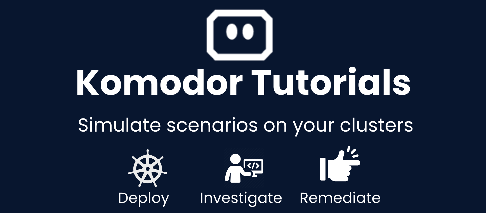

# Komodor Failure Scenarios

This repository is your go-to repository to run scenarios on your clusters. It allows you simulate a day-to-day real life scenario besides edge cases. After running these scenario, you will be able to see how Komodor can help you to easily identify and remediate these scenarios.

## How to Use?
Pick a scenario from the list below, apply it to your cluster. Check in Komodor the right resources (usually a service).

## Before Starting

Make sure you got the Komodor agent running and configured on your clusters.
Configure alerts to get alert in each failure.

## Scenarios

### Deploy Scenarios

- Image Pull backoff
    - Purpose: This deploy, use an non exist image and cause ImagePullBackoff
    - [Link](./deploys-scenarios/failed-deploy-image-pull-backoff).
  
- Create Container Config Error
    - Purpose: This deploy, using a non exist secret.
    - [Link](./deploys-scenarios/failed-deploy-creation-config-error).

### Failure Scenarios

  
- Out of Memory
    - Purpose: This scenario, runs a service which fails because of OOMKilled.
    - [Link](./failure-scenarios/OOMKilled).
  
- Application Issue
    - Purpose: This scenario, cause an application failure with an informative logs messages.
    - [Link](./failure-scenarios/application-error-with-exception).
  
- Failed Scheduling
    - Purpose: This scenario, spawns a pod that can't run on any node within the cluster.
    - [Link](./failure-scenarios/failed-to-schedule-pods).
  
- Crash Loop Backoff
    - Purpose: This scenario, cause a deployment to go into CrashLoopBackoff state.
    - [Link](./failure-scenarios/crashloop).
