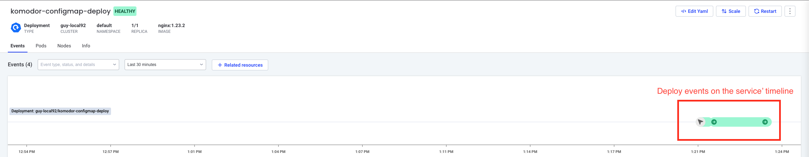
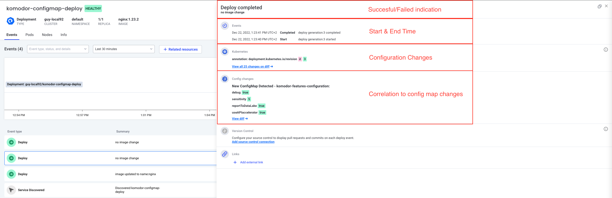

# Scenario: Correlate Deploy Event with Configmap Changes

## Why Is It Important?
Many services are using configmap to separate the code from the running configuration. When there is a value change in the config map, it is very hard to correlate it with the deployment change.

## Real Life Example
A user pushed a change that changes the configuration value and when someone else, like yourself is coming to troubleshoot. The information about the configuration change is invisible.

## How Komodor Helps?
Komodor correlates changes across the system to a deploy event in a service. You can quickly identify all changes related to a specific deploy by only clicking on the deploy event.

Komodor shows the deploy events on the timeline:


For each deploy events you have the full information about the deploy:



## How To Run?
1. Apply step1.yaml
``` bash
kubectl apply -f https://raw.githubusercontent.com/komodorio/komodor-tutorials/master/deploys-scenarios/a-simple-deploy-with-a-configmap-change/step1.yaml
```
2. Apply step2.yaml
``` bash
kubectl apply -f https://raw.githubusercontent.com/komodorio/komodor-tutorials/master/deploys-scenarios/a-simple-deploy-with-a-configmap-change/step2.yaml
```
3. [Go to the relevant service in Komodor](https://app.komodor.com/services?textFilter=komodor-configmap-deploy) and click on the deploy event created.
   