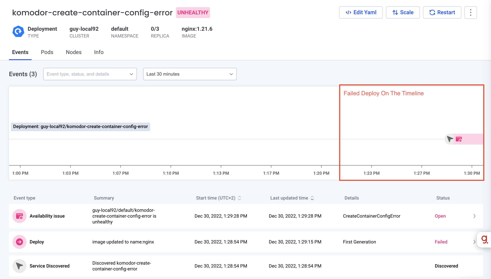
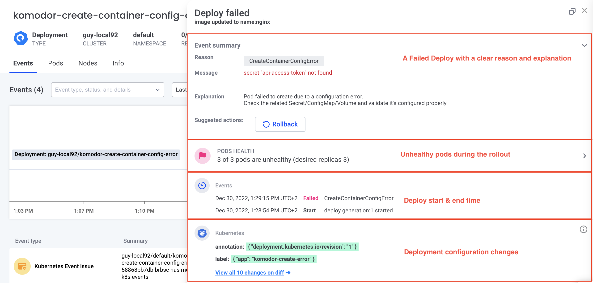

# Scenario: Investigate Failed Deploy Because Of a Bad Reference To a ConfigMap

## Why Is It Important?
Many services are using ConfigMaps to separate the code from the running configuration. In a case where there is a reference in a deployment to a non-exist config map. This bad ref causes failure to create the new pods.

## Real-Life Example
A user wants to add a new configuration to the deployment, so it creates a new config map and changes the deployment configuration to get value from the config map. But the user ref to a configmap that is not in the cluster and maybe even a small typo. All of that will cause the pods to fail to be created.

## How Komodor Helps?
Komodor detects the failed deploy, correlates it with the applied changes to the deployment configuration and the configmap, and shows exactly why the deploy failed with a clear explanation.

Komodor shows the deploy events on the timeline:


For each deploy event you have the full information about the deploy and why it failed:



## How To Run?
1. Apply a deployment with healthy status:
   ``` bash
   kubectl apply -f https://raw.githubusercontent.com/komodorio/komodor-tutorials/master/deploys-scenarios/failed-deploy-creation-config-error/healthy-deploy.yaml
   ```
2. Apply the deployment with a bad ref to a secret:
    ``` bash
   kubectl apply -f https://raw.githubusercontent.com/komodorio/komodor-tutorials/master/deploys-scenarios/failed-deploy-creation-config-error/createcontainerconfigerror.yaml
   ```
3. [Go to the relevant service in Komodor](https://app.komodor.com/services?textFilter=komodor-create-container-config-error) and click on the deploy event created.
   