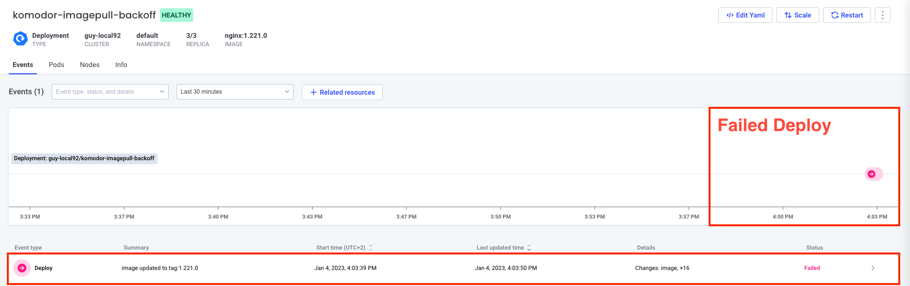
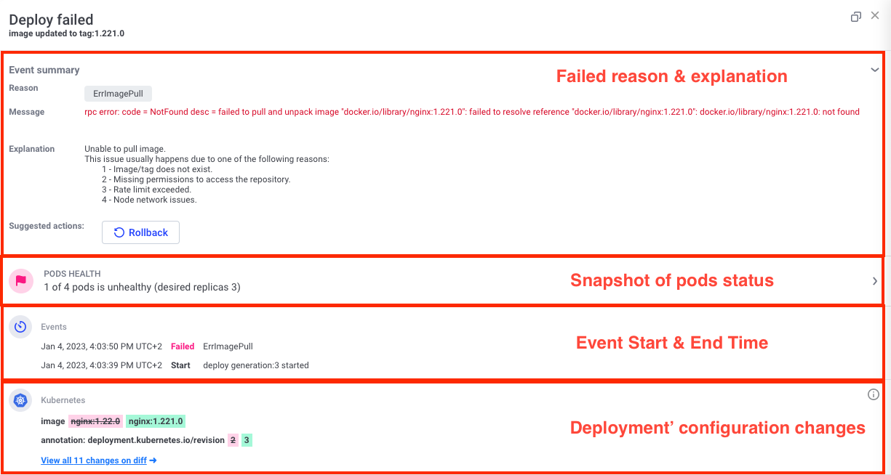
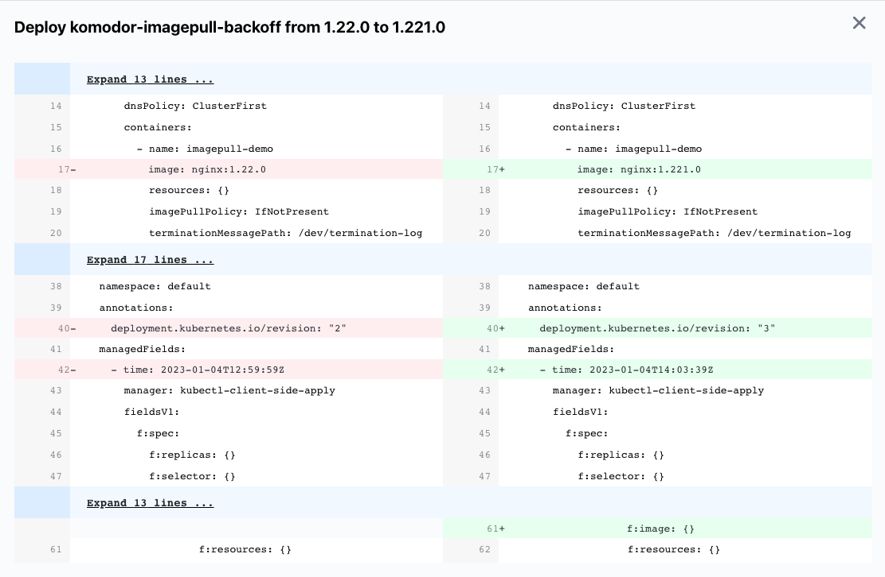

# Scenario: Troubleshoot ImagePullBackoff

## Why Is It Important?
From time to time, an image pull error can occur and cause the pods to not be able to start and run the application. Usually, it happened when the repository is not accessible or doesn't have the image.

## Real Life Example
This problem can happen when someone changes the credentials to the repository and made the secret to it invalid or someone tried to change the image name/tag of a 3rd party tool.


## How Komodor Helps?
Komodor shows the failure reason, the explanation for the error, and what changed in the latest deploy. The user who gets the error understands much fast why the service failed and what changed to fix it.

Komodor shows the failed deploy events on the timeline:


For each deploy event you have the full information about the deploy with the errors that caused it to fail:


You can click on the diff to see the configuration changes made during this deploy:



## How To Run?
1. Apply an healthy deployment [nginx-image-healthy.yaml](nginx-image-healthy.yaml)
``` bash
kubectl apply -f nginx-image-healthy.yaml
```
2. Apply the same deployment with a wrong image [imagepullbackoff.yaml](imagepullbackoff.yaml)
``` bash
kubectl apply -f imagepullbackoff.yaml
```
3. [Go to the relevant service in Komodor](https://app.komodor.com/services?textFilter=komodor-imagepull-backoff) and click on the deploy event created.
   