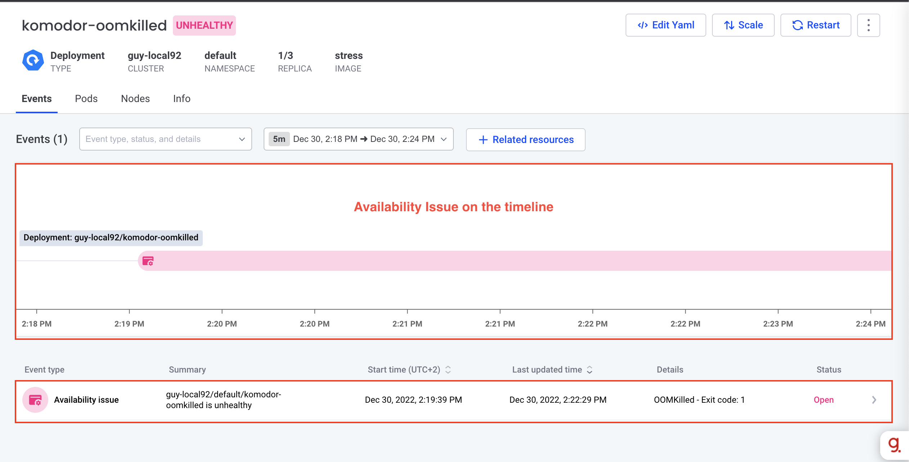
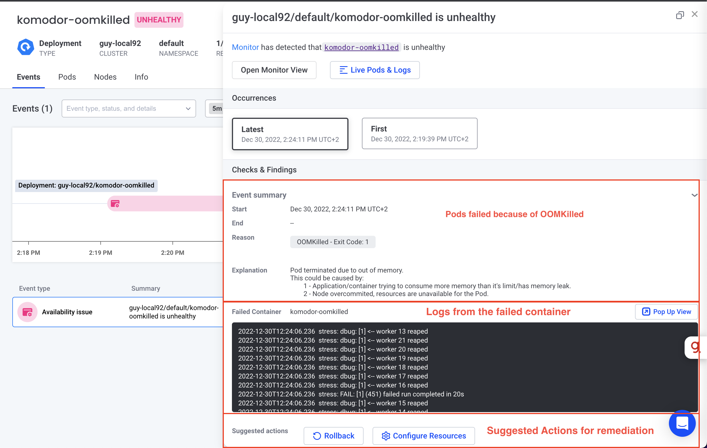

# Scenario: Application failed because of OOMKilled

## Why Is It Important?
OOMKilled is an error that may be difficult to discover. It is transient and requires some expertise to find. It can cause a massive impact on the service itself and other services in the same cluster (noisy neighbor).

## Real-Life Example
The application starts to be "killed" because the container exceeds the memory limit. The reason for the failure is not clear. Was the error caused by an application issue or infrastructure issue. 

## How Komodor Helps?
Komodor detects the OOMKilled failure and immediately shows the reason even if it's gone from the cluster. Komodor also correlates the OOMkilled with infrastructure failure and lets you know if it's an application issue or an infrastructure issue. 

Komodor shows the failed events on the timeline:


Komodor shows the failure reason explicitly with all the relevant information for you to find out how to fix the issue as quickly as you can and without reading endless manuals.



## How To Run?
1. Apply [oom.yaml](oom.yaml)
   ``` bash
   kubectl apply -f oom.yaml
   ```

    It takes ~2 minutes for the OOM the start.

2. [Go to the relevant service in Komodor](https://app.komodor.com/services?textFilter=komodor-oomkilled) and click on the deploy event created.
