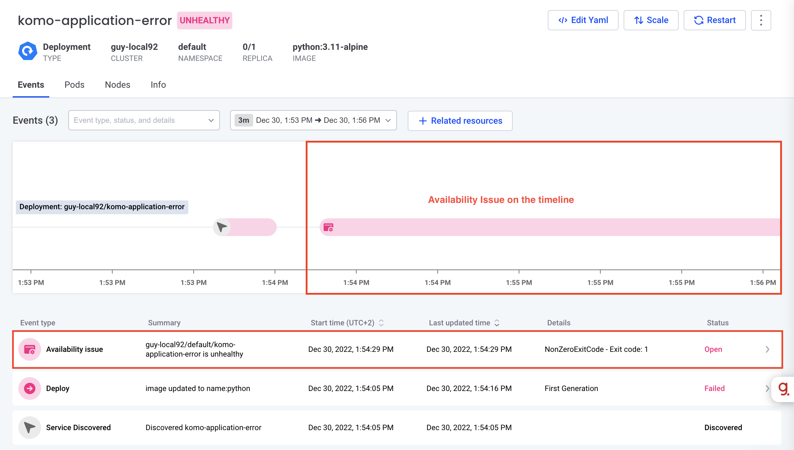
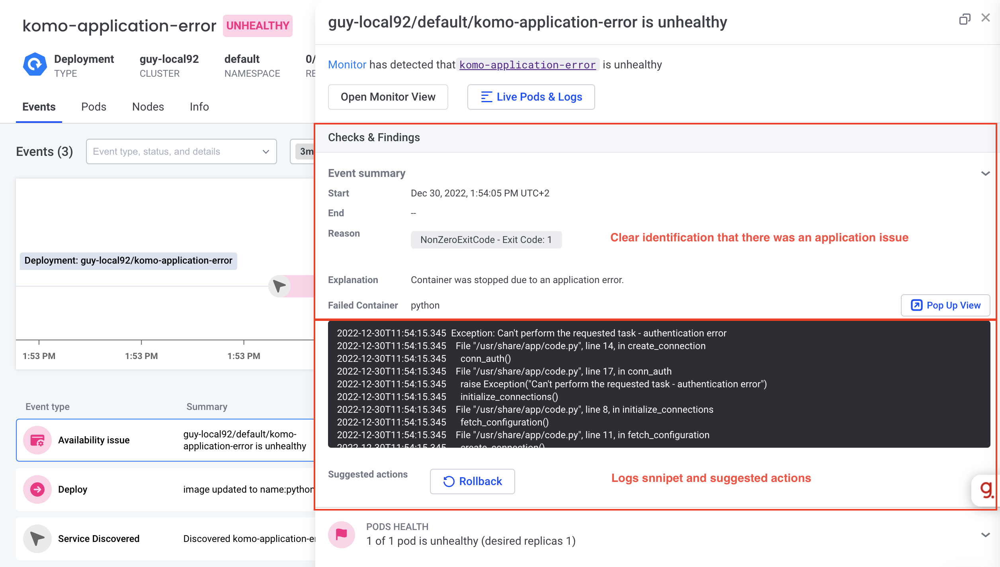
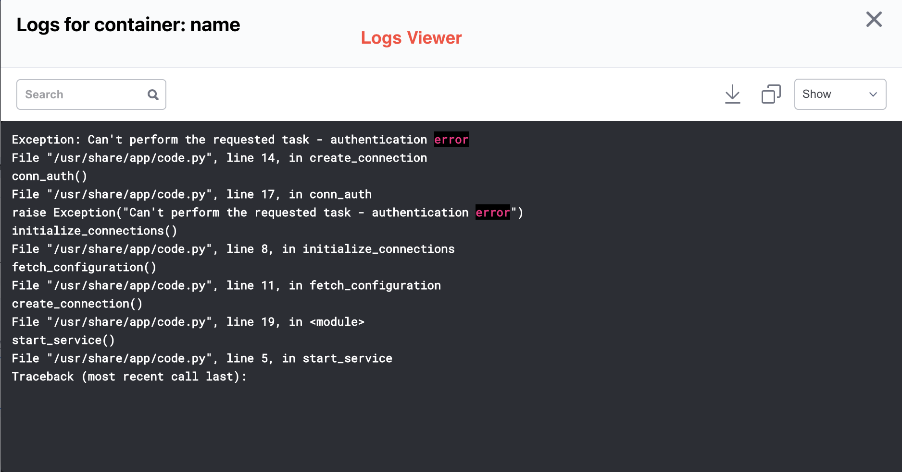

# Scenario: Application Failure

## Why Is It Important?
Every service is prone to application failures. Some of these failures are minor while others can cause the pods to crash and the application to become completely unavailable. 

## Real-Life Example
A developer pushed a new code to the service with a bug and since then the pods of the service are continuously crashing. 

## How Komodor Helps?
Komodor automatically detects that there is an issue and immediately runs a playbook to investigates the issue's root cause.
Komodor shows the user all checks and findings initially the root cause, which is an application issue correlated with
the container logs, metrics, and recent changes, to solve the problem quickly as possible. Instead of giving an indicative message like `CrashLoopBackOff`.


Komodor shows the availability issue & the failed deploy events on the timeline:


In the availability issue, you have the full information about the issue, like time, reason, explanation, relevant information and logs. It's easy to identify that this issue is caused by an application problem:


You can also view logs to debug the application:



## How To Run?
1. Apply [application-error.yaml](application-error.yaml)
``` bash
kubectl apply -f application-error.yaml
```
2. [Go to the relevant service in Komodor](https://app.komodor.com/services?textFilter=komo-application-error) and click on the availbility issue created.
